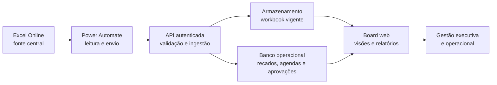

# Delivery Control Center

Blueprint público de uma solução de gestão de delivery baseada em uma fonte operacional compartilhada no Excel Online, sincronização pelo Power Automate e um board web para acompanhamento executivo, governança, evidências e rastreabilidade.

O conteúdo deriva de uma implementação real, mas foi integralmente anonimizado. Não contém nomes de organizações, pessoas, links, credenciais, dados operacionais, documentos, IDs, evidências ou configurações internas.

## O problema resolvido

Planilhas compartilhadas são úteis para execução, mas ficam difíceis de consumir quando o programa precisa combinar:

- backlog operacional e roadmap;
- responsabilidades, datas, riscos e dependências;
- situação atual, próxima ação e evidência;
- visão executiva e consulta detalhada;
- governança de RBAC, SoD, IGA, PAM e Access Management;
- histórico de atualização e comprovação de sincronização.

## A solução

## Princípios

1. O Excel Online é a fonte operacional oficial.
2. O board é uma camada de leitura e colaboração, não uma segunda fonte concorrente.
3. Toda atividade possui ID estável e rastreável.
4. Evidência documental não equivale a implantação.
5. Status, percentual, aceite, implementação e conclusão são estados independentes.
6. Atualização só é concluída após salvar, reabrir e conferir a fonte.
7. Um HTTP 200 comprova ingestão técnica, não necessariamente a correção semântica do conteúdo.
8. Alterações de roadmap exigem fundamento de prazo, dependência ou decisão; avanço de análise não desloca linha do tempo por si só.

## Conteúdo do repositório

- [Arquitetura](docs/02-arquitetura.md)
- [Modelo da fonte Excel](docs/03-modelo-excel.md)
- [Fluxo do Power Automate](docs/04-power-automate.md)
- [Board e relatórios](docs/05-board-e-relatorios.md)
- [Como gerenciar RBAC](docs/06-gestao-rbac.md)
- [Como gerenciar o projeto](docs/07-gestao-projeto.md)
- [Evidências e auditoria](docs/08-evidencias-e-auditoria.md)
- [Segurança e hardening](docs/09-seguranca.md)
- [Operação e incidentes](docs/10-operacao-e-incidentes.md)
- [Checklist de implantação](docs/11-checklist-implantacao.md)
- [Templates vazios](templates/)

## Limites

Este material é um blueprint técnico. Não contém dados de demonstração inventados, não substitui validação de arquitetura, segurança, privacidade ou compliance e não deve ser aplicado em produção sem adequação ao ambiente-alvo.

## Licença

Distribuído sob a licença MIT. Consulte [LICENSE](LICENSE).
