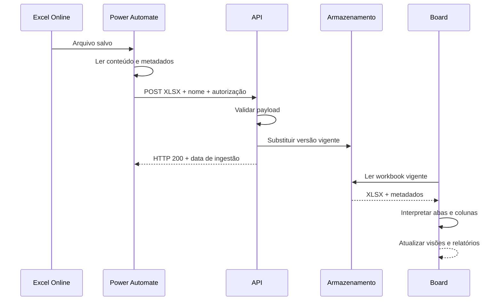

# Arquitetura

## Componentes

| Componente | Responsabilidade |
|---|---|
| Excel Online | Fonte oficial do backlog e do roadmap |
| Power Automate | Detecta/agenda leitura do arquivo e envia o workbook vigente |
| Endpoint autenticado | Valida credencial, nome, extensão, tamanho e estrutura básica do XLSX |
| Armazenamento de objetos | Mantém a versão vigente do workbook para leitura pelo board |
| Banco operacional | Mantém recados, agendas e registros de aprovação separados do arquivo |
| Board web | Processa o workbook, apresenta visões e gera relatórios |
| Logs | Comprovam chamadas, status HTTP, resultado, horário e identificador de requisição |

## Fluxo de dados

## Por que separar arquivo e colaboração

O workbook é melhor para tabelas estruturadas e edição compartilhada. Recados, agendas e aprovações possuem ciclo próprio, consultas frequentes e anexos. A separação reduz acoplamento e evita regravar o Excel para cada interação do board.

## Requisitos de confiabilidade

- idempotência no recebimento;
- controle de tamanho e extensão;
- autenticação do endpoint;
- metadados de arquivo, origem e horário;
- cache desabilitado para a fonte vigente;
- logs sem exposição de segredos;
- rollback pela versão anterior do repositório de origem;
- monitoramento de falhas e fila de reprocessamento.
